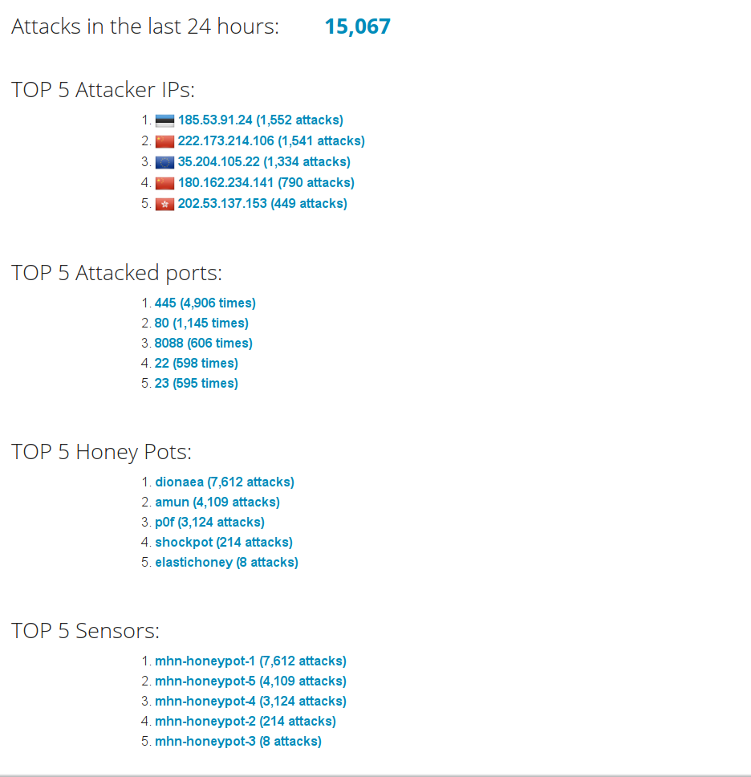
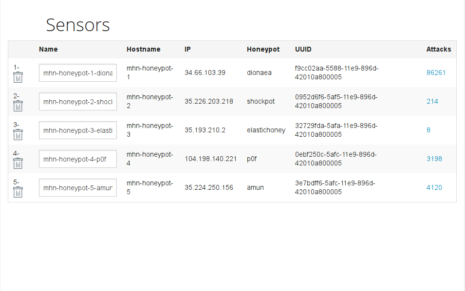
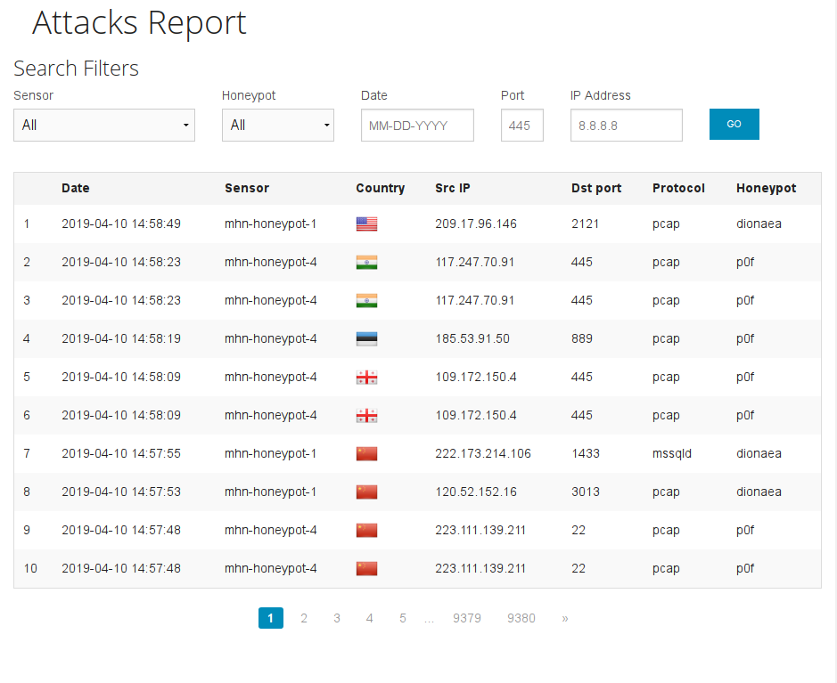

# Codepath-Honeypot
Unit 10 and 11 of the Codepath course. Created honeypot and collected data.

## Overview and Setup
I used Google Cloud Platform to create the MHN Admin VM and MHN Honeypot VMs by following the Codepath
Honeypot Project Assignment instructions fairly closely.

I started by setting up firewall rules for the MHN Admin machine with TCP ports 80, 3000, and 10000.
I then used the `gcloud compute instances create` command to create a VM on the Google Cloud Platform.

I used an updated version of Ubuntu, `--image "ubuntu-1404-trusty-v20190321`, and I changed the
machine type from `f1-micro` to `g1-small` in order to deal with the RAM issues I had from installing
the mhn-admin software the first time I attempted this.

The MHN Admin VM was created with the device name `mhn-admin` and I followed instructions to the letter for
installing the mhn admin software on it.
There was a few issues regarding mongodb and some of the python source code. The python code needed to be edited
to import the correct libraries. The original code had the incorrect case for the library names.
Once the services were up and running correctly, I connected to the assigned IP address and navigated to 
the Deploy tab

I deployed Dionaea with HTTP on a new VM named `mhn-honeypot-1`. This new VM used all the same instance values
as the MHN Admin VM did, but the honeypot VM had different firewall rules so that traffic would be allowed on all ports.

I also deployed the following additional virtual honeypots:

Shockpot on `mhn-honeypot-2`
ElasticHoney on `mhn-honeypot-3`
P0f on `mhn-honeypot-4`
Amun on `mhn-honeypot-5`

These honeypot deployments were selected arbitrarily at random just to get some variety.

Dionaea ran for a week by itsself and the rest of them were added a few days before this write up.
Data on all was collected over at least a 24-hour period prior to this writeup.

## Demonstration
#### Here is the results from collecting data over a 24-hour period

###### Overview

###### Sensors Deployed

###### Attacks Example

__The export of the raw data from mongodb to json is available in this repository as session.json__

